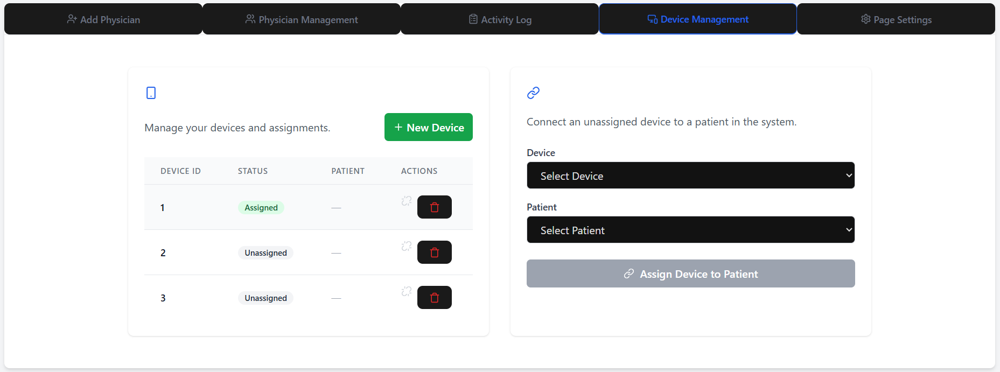

# Individual Weekly Report

**Name**:
Brandon Fornero

**Team**: 
Stroke Rehab

**Date**: 
3/24/2025

## Current Status
We got automatic uploads from the raspberry pi working to azure. We also got live chat
between physician and patients "working", but there is definitely some bug fixes
to work through. Most of the sites main functionality is working, and we need 
to work on polishing.

### What did _you_ work on this past week?

| Task | Status | Time Spent | 
| ---- | ------ | ---------- |
| Added device to database schema  | complete | 1 hour |
| Added device management to frontend | complete | 2 hour |
| Adding files table to db | in progress | 10 minues |
| Protect device management in backend | in progress | 30 minues |

### What problems did you run into? What is your plan for them?

Getting relations to work in sql alchemy was difficult because I had never done
it before. I read the docs (rtfm) and figured it out.

### What is the current overall project status from your perspective? 

We are nearing completion in my opinion. It looks like sprint 4 will be polishing.

### How is your team functioning from your perspective?

We are functioning great as a team. Very good communication and work ethic. 

### What new ideas did you have or skills did you develop this week?

I have learned so much about raspberry pi and firmware. This is my first time being
able to do this. 

### Who was your most awesome team member this week and why?

Sam was the greatest team member this week for getting the motion file to run on the frontend

## Plans for Next Week

*What are you going to work on this week?*

Adding database entries linking to motion uploads!

